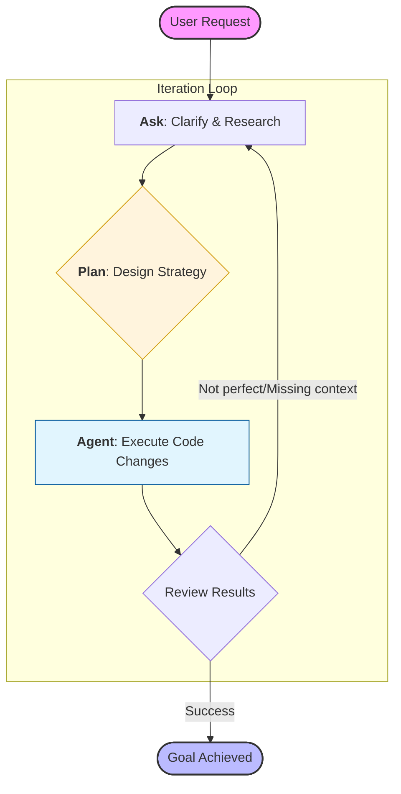

```mermaid
%%{init: {'theme': 'default', 'themeVariables': {'signalColor': '#ffffff', 'actorLineColor': '#ffffff'}}}%%
flowchart TD
    Start([User Request]) --> Ask[<b>Ask</b>: Clarify & Research]
    Ask --> Plan{<b>Plan</b>: Design Strategy}
    Plan --> Agent[<b>Agent</b>: Execute Code Changes]
    Agent --> Review{Review Results}
    Review -- "Not perfect/Missing context" --> Ask
    Review -- "Success" --> End([Goal Achieved])

    subgraph Iteration Loop
        Ask
        Plan
        Agent
        Review
    end

    style Start fill:#f9f,stroke:#333,stroke-width:2px
    style End fill:#bbf,stroke:#333,stroke-width:2px
    style Plan fill:#fff4dd,stroke:#d4a017
    style Agent fill:#e1f5fe,stroke:#01579b
```