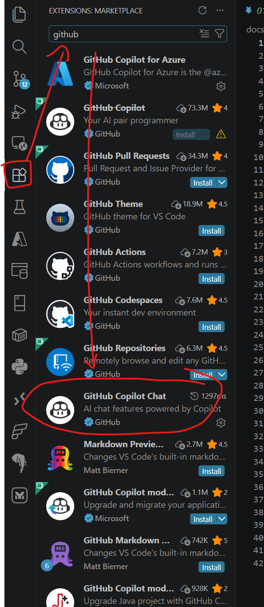
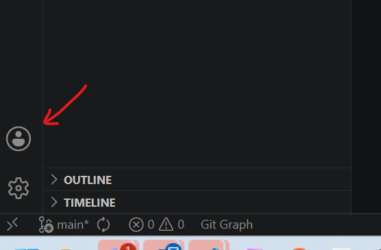

# 01 - Setup Inicial e Instalación

Para comenzar con GitHub Copilot, necesitamos preparar nuestro entorno de VS Code y asegurarnos de que la conexión sea estable, especialmente en entornos corporativos.

## 1. Instalación de Extensiones

Busca e instala las siguientes extensiones desde el Marketplace de VS Code:

1.  **GitHub Copilot Chat**: La interfaz de chat y funcionalidad inline (`Ctrl+I`).




## 2. Login y Activación

Una vez instaladas:
1.  Haz clic en el icono de **Usuario** en la esquina inferior izquierda (o el icono de Copilot en la barra de estado).
2.  Selecciona **Sign in to GitHub**.
3.  Sigue los pasos en el navegador para autorizar VS Code.
4.  Si todo es correcto, verás el icono de Copilot en la barra de estado inferior sin errores.



## 3. Configuración del Proxy Corporativo (UV/PIP)

En entornos con proxy corporativo, podrías experimentar problemas de certificados SSL (`SSL: CERTIFICATE_VERIFY_FAILED`). Para trabajar con Python de forma fluida en este repo:

### Para `uv`:
Utiliza estos flags para permitir hosts inseguros localmente:
```sh
uv sync --allow-insecure-host files.pythonhosted.org --allow-insecure-host pypi.org
uv add <pkg> --allow-insecure-host files.pythonhosted.org --allow-insecure-host pypi.org
```

### Para `pip`:
```sh
pip install <pkg> --trusted-host files.pythonhosted.org --trusted-host pypi.org
```

> **Nota**: Estos flags solo son necesarios para la instalación de dependencias local.

---
[Próxima Sesión: Funcionalidades Básicas](02-basicos.md)
