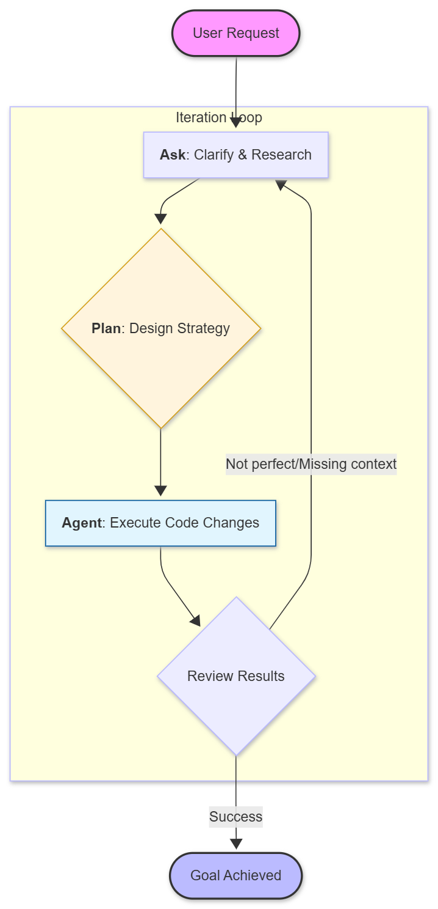

# 02 - Basic Features

In this section, we will explore how to interact with Copilot in your daily workflow.

## 1. Ghost Text (Proactive Autocomplete)

Copilot suggests code as you type. These suggestions appear in gray (hence "Ghost Text").

**Exercise:**
1. Open a new file in `src/test_logic.py`.
2. Start typing a function to calculate the area of a circle.
3. Observe how Copilot proposes the body of the function.
   - `Tab` to accept.
   - `Alt + [` or `Alt + ]` to navigate between options.
   - `Ctrl + Enter` to see a panel with 10 complete suggestions.

## 2. Next Edit Suggestions

Copilot is now able to predict where you will make your next change based on your recent edits. You will see a change suggestion even before you start typing on that line.

## 3. Inline Chat (`Ctrl + I`)

Inline Chat is ideal for localized changes or quick refactorings without losing the focus of the file.

**Pro tips:**
- Select a block of code and press `Ctrl + I`.
- Ask: `/fix` to fix errors.
- Ask: `/doc` to generate documentation.
- Ask: "Convert this for loop into a list comprehension".

## 4. Chat & Interaction Modes (`Ctrl + Alt + I`)

The Chat panel is the hub for complex tasks. It uses the **Gemini 3 Flash (Preview)** model to help you research, plan, and execute changes.

### A. Ask (Chat)
Use this for quick questions, explaining code, or debugging errors. It's a conversational interface where you can ask things like "What does this function do?" or "Why am I getting a ValueError here?".

### B. Plan
When you have a multi-step task, use the **Plan** mode. Copilot will research your workspace, look for relevant files, and propose a step-by-step strategy *before* writing any code. This is perfect for designing new features or architectural changes.

### C. Agent
The **Agent** mode (often triggered by specific tools or settings) allows Copilot to work autonomously. It can browse the web, read files, and suggest complete file changes across the workspace to fulfill your request.

**Pro tips:**
- Use `/explain` to get a deep walkthrough of a complex logic or the overall architecture.
- Use `/fix` to propose solutions for workspace-wide errors or performance bottlenecks.
- Use `/doc` to generate comprehensive documentation for modules or entire directories.
- Use `@file` to focus the model on specific files.
- Be iterative: If the first answer isn't perfect, refine your prompt.

### Ideal Iterative Flow

---
[Next Session: Customization and Gitflow](03-customization.md)
