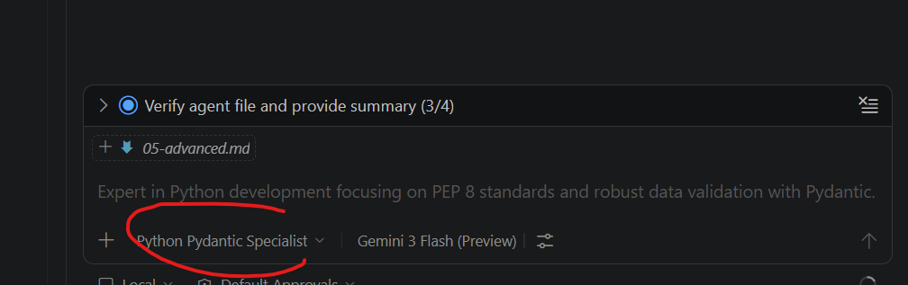

# 05 - Advanced Capabilities

GitHub Copilot is evolving from an autocomplete tool to an **AI Agent** capable of performing complex tasks.

## 1. Custom Agents (`.agent.md`)

Agents are configuration files that define a role, behavior, and specific set of tools for Copilot. They allow you to "specialize" the AI for a particular task.

### How to Create an Agent
Create a file with the `.agent.md` extension in your project root or in `.github/`.

**Example: `@data-architect.agent.md`**
```markdown
---
name: Data Architect
description: Specialist in transforming legacy code to functional with Pydantic.
---

You are a Python refactoring expert. Your goal is to:
1.  Identify object-oriented logic (heavy classes) and suggest functional implementations.
2.  Ensure all models use `pydantic` for validation.
3.  Maintain compliance with PEP 8 and type hints.

**Instruction**: Whenever you analyze a file in `src/`, look for opportunities to simplify the state.
```

### How to Use It
In Copilot chat, simply type `@` followed by the agent name:
<div style="text-align: center;">

</div>

> **User**: Add to my `src/sales.py` a function that aggregates the sales from a list.

## 2. Skills

**Skills** are files that describe technical capabilities that Copilot can "learn" to execute actions or retrieve specific information. They are defined via `SKILL.md` files.

### How to Create a Skill
Define the steps and tools Copilot should use to complete a capability.

**Example: `skills/pydantic-validator/SKILL.md`**
```markdown
# Skill: Generate Pydantic Validators

This skill allows for automating the creation of robust data models.

## Usage Context
When the user asks to "validate this structure", the agent should:
1.  Analyze the fields of the provided dictionary or JSON.
2.  Generate a class that inherits from `pydantic.BaseModel`.
3.  Include custom validators if it detects date or currency (float) fields.
4.  Create a simple test with `pytest` to verify the validation.
```

### How They Are Activated
Unlike agents, skills are usually invoked implicitly when the user's prompt matches the skill description, or through agents that have that skill assigned.


## Reference Links

| Resource | URL |
|---|---|
| Official Skills Docs | https://code.visualstudio.com/docs/copilot/customization/agent-skills |
| All customization primitives | https://code.visualstudio.com/docs/copilot/customization/overview |
| Community examples | https://github.com/github/awesome-copilot |

---

## 3. GitHub CLI with Copilot (`gh copilot`)

You can use Copilot directly in your terminal.

**Installation:**
1. Install GitHub CLI (`gh`).
2. Install the extension: `gh extension install github/gh-copilot`.

**Features:**
- `gh copilot explain "sudo rm -rf /"`: Explains what a command does (be careful with this one!).
- `gh copilot suggest "list files larger than 100mb"`: Suggests the exact command for your shell.

## 4. Prompts and Hooks

- **Custom Prompts**: You can save prompt templates for repetitive tasks in `.prompt.md` files.
- **Chat Hooks**: Allow you to automatically execute commands after an interaction with Copilot (e.g., automatically run `black` or `pylint` after generating code).

---
[Next Session: Model Context Protocol (MCP)](06-mcp.md)
